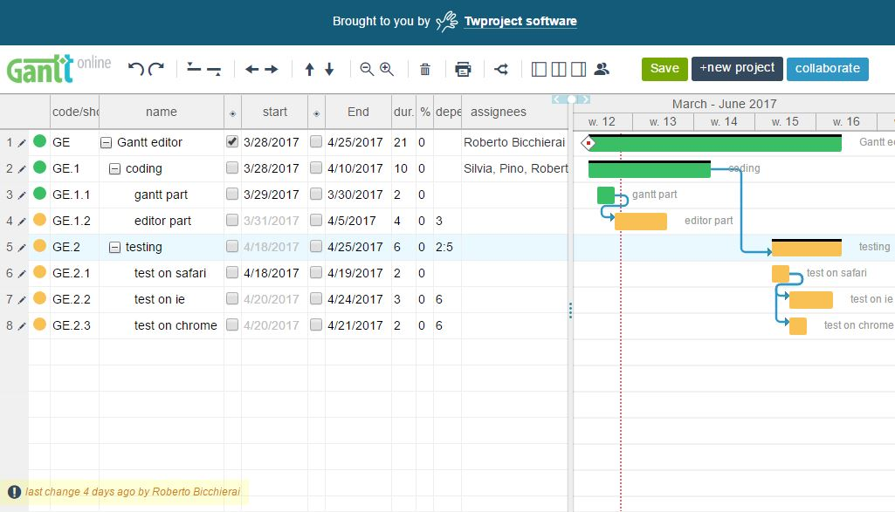

kGantt
======

Based on jQueryGantt, a jQuery based Gantt editor written by Roberto Bicchierai and Silvia Chelazzi, part of the
[Twproject](https://twproject.com), with code available at https://github.com/robicch/jQueryGantt.

These are some key features from jQueryGantt that are still true in kGantt:

* jQuery based 3.2
* MIT licensed: you can reuse everywhere https://opensource.org/licenses/MIT
* JSON import-export
* internationalizable
* manage task status –> project workflow
* manage dependencies
* manage assignments (resources, roles efforts)
* server synchronization ready
* full undo-redo support
* cross browser (at least for recent versions)
* keyboard editing support
* SVG visual editor
* print friendly
* collapsible branches
* critical path
* milestones, progress etc.
* zoom
